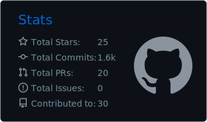
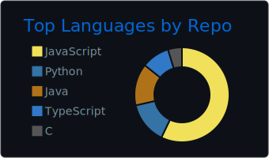

<h2 align="center">💻 Welcome to My GitHub Profile!</h2>

  

---

<h2 align="center">👨🏻‍💻 About Me</h2>

<table>
  <tr>
    <td align="left" width="55%">

<ul>
  <li>🎓 Information Technology Undergraduate at SLIIT</li>
  
  <li>🌱 Learning Python | MERN | Spring Boot</li>
  
  <li>🔭 Working on University & Personal Projects</li>
  
  <li>🎯 Goal: Become a AI Engineer | AI/ML Enthusiast</li>
  
  <li>💡 Passionate about building scalable and user-friendly applications</li>
  
  <li>📫 How to reach me <a href="mailto:lithiraliyanage666@gmail.com">lithiraliyanage666@gmail.com</a></li>
</ul>

</td>

<td align="center" width="45%">
  
</td>
  </tr>
</table>

 

<h2 align="center">🛠️ Tech Stack</h2>

 

##  🏆 GitHub Stats

 

  
  

<h2 align="center">
  
  

---

<h2 align="center">🐍 Contribution Snake</h2>

  

 

<h2 align="center">🌐 Connect with Me</h2>

  
  
  

  

 

